# databel-customer-churn-analysis
A comprehensive analysis of customer churn at Databel. This project explores key drivers of churn and provides actionable insights through data visualizations, aiming to enhance customer retention strategies.

# Databel: Customer Churn Analysis

## Overview
This case study investigates customer churn trends at Databel, focusing on identifying key drivers and actionable insights using Tableau. The project explores various factors contributing to churn, such as demographics, geographic location, payment methods, and contract types, and provides data-driven recommendations for improving customer retention.

---

## Analysis Steps

### **Step 1: Data Quality Check**
- **Objective:** Identify duplicate entries in the customer dataset.
- **Approach:** Used COUNT and COUNTD calculated fields.
- **Result:** The dataset contains **6,687 unique customers**.

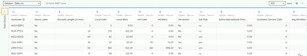
---

### **Step 2: Calculating Churn Rate**
- **Objective:** Measure the overall churn rate.
- **Approach:** Created a "Churned" column to label churned customers.
- **Results:**
  - Number of churned customers: **1,796**
  - Churn rate: **26.86%**

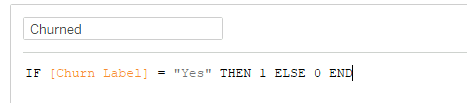

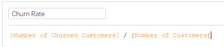
---

### **Step 3: Investigating Churn Reasons**
- **Objective:** Identify primary reasons for customer churn.
- **Approach:** Created a bar chart to visualize churn reasons.
- **Key Insights:**
  - The **"Competitor"** category accounts for **44.82%** of all churn, making it the most significant reason.

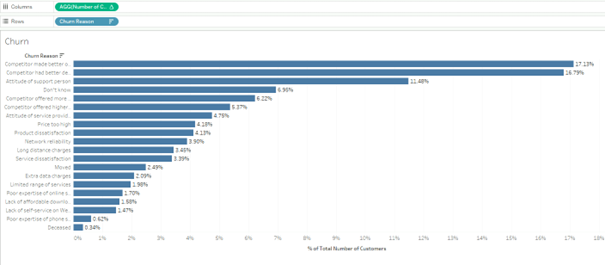

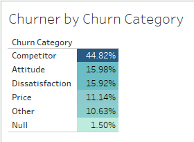

---

### **Step 4: Geographic Analysis**
- **Objective:** Examine churn variations across regions.
- **Approach:** Mapped churn rates by state to evaluate competitor promotions.
- **Key Insight:**
  - **California** has the highest churn rate at **63%**.
  - 
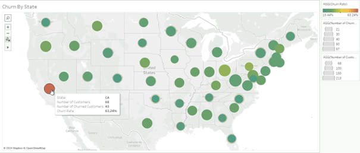
---

### **Step 5: Demographic Analysis**
- **Objective:** Assess the impact of demographic factors on churn.
- **Key Insight:**
  - Senior citizens churn at a rate of **38%**, which is **10% higher** than the average.

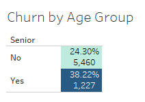
---

### **Step 6: Age Group Analysis**
- **Objective:** Analyze churn trends by age groups.
- **Approach:** Created age bins and visualized churn rates.
- **Observation:**
  - Churn rates are highest among customers aged **65 and older**, although this group has the lowest customer count.
  - 
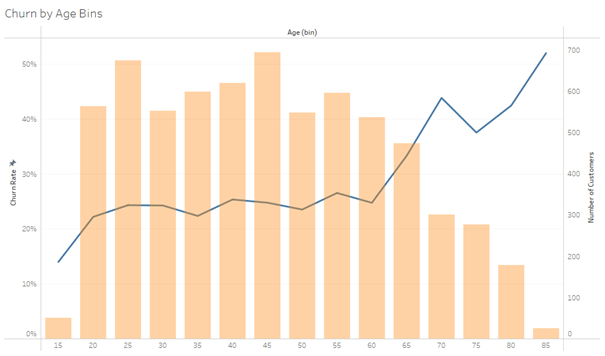
---

### **Step 7: Group Contracts Analysis with Parameters**
- **Objective:** Analyze whether group contracts affect churn rates and explore their impact on customer bills using interactive parameters.
- **Approach:**
  - Created a dynamic parameter allowing users to toggle between different metrics (e.g., churn rate, average bill).
  - Built a calculated field to dynamically display the selected measure based on the parameter.
- **Key Insights:**
  - Customers with group contracts show a significantly lower churn rate (**6.51%**) compared to the overall average.
  - Despite their lower churn rates, **75% of customers** do not have group contracts, suggesting an opportunity to expand this offering.

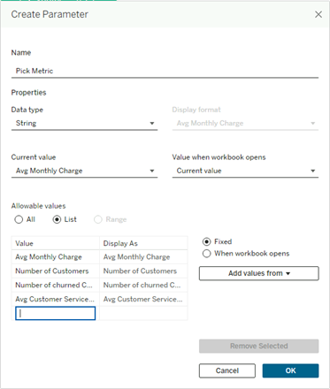

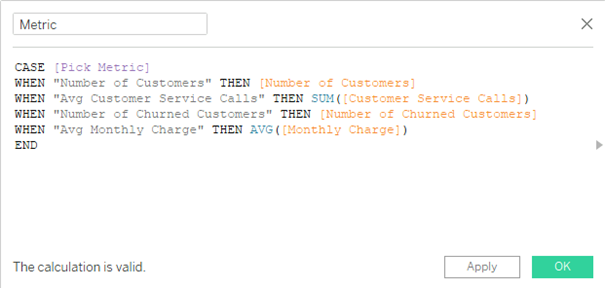
---

### **Step 8: Unlimited Plans**
- **Objective:** Analyze the influence of an unlimited plan on churn rate.
- **Approach:**
  - Built a calculated field to understand the distribution of GB downloaded.
- **Key Insights:**
  - People who consume **5GB or less** are more likely to churn.

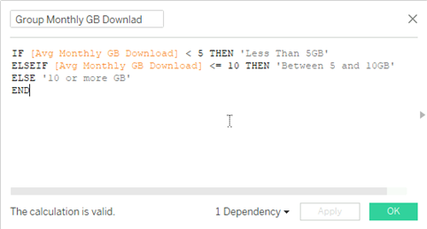

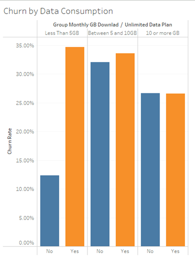
---

### **Step 9: International Calls**
- **Objective:** Analyze the behavior of customers who call internationally and their churn rate.
- **Approach:**
  - Created a table showing international activity and churn rate.
- **Key Insights:**
  - Despite a high churn rate, this group represents a small customer base and has the highest average monthly charge of all groups.
- **Recommendation:**
  - Propose a cheaper plan for international callers to increase satisfaction and reduce churn.

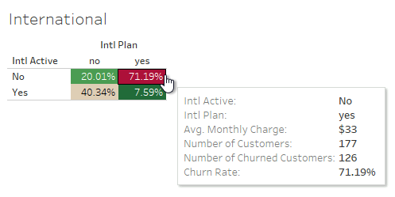
---

### **Step 10: Contract Types**
- **Objective:** Analyze churn rate based on contract type, payment type, and account length.
- **Approach:**
  - Created a scatter plot to analyze these variables.
- **Key Insights:**
  - **Month-to-month contracts** have the highest churn rate.
  - The **Direct Debit** payment method accounts for the largest group of churned customers (**1,141 churned**).

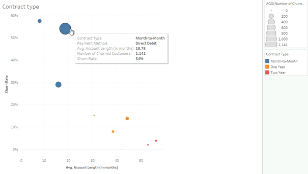
---

## Dashboard Insights and Recommendations

### **1. Overview**
- **Description:**  
  The "Overview" page provides a high-level view of customer churn, summarizing key metrics and visualizing the overall churn rate and its distribution across different segments.
- **Insights:**
  - This page offers an immediate understanding of the overall churn rate, with breakdowns by demographics, geography, and contract type.

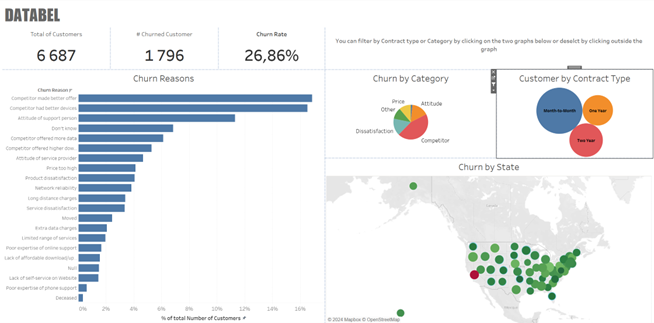
---

### **2. Demographics, Ages, and Groups**
- **Description:**  
  This page analyzes churn rates across different age groups and examines the impact of group contracts on churn behavior.
- **Insights:**
  - **Senior citizens (65+)** exhibit the highest churn rates, far exceeding the average churn of 26.86%.
  - Customers in **group contracts** have a much lower churn rate (**6.51%**).

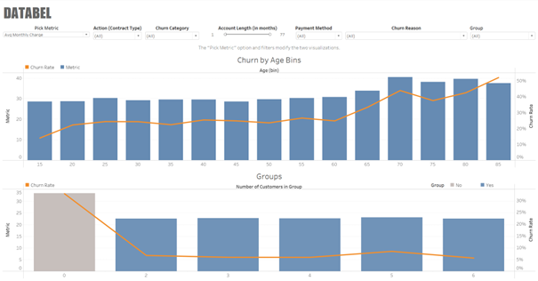
---

### **3. International and Data Plan**
- **Description:**  
  This page focuses on customers' data usage and international calling habits, visualizing how these factors correlate with churn rates.
- **Insights:**
  - Customers using **less than 5GB/month** of data have a higher likelihood of churn.
  - **International callers** show higher monthly charges but represent a smaller segment.

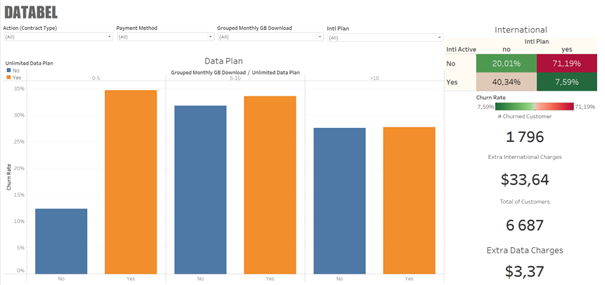
---

### **4. Payment Method and Contract Type**
- **Description:**  
  This page compares churn rates based on payment methods (e.g., Direct Debit) and contract types (month-to-month vs. long-term).
- **Insights:**
  - **Month-to-month contracts** have the highest churn rates, indicating that these customers are more likely to leave after short-term commitments.
  - Customers using **Direct Debit** have a large proportion of churned customers.

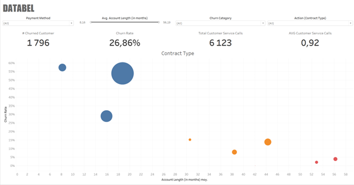
---

## Recommendations
- **Group Contracts:**  
  Expand group plans and target families or small businesses with offers designed to reduce churn.
  
- **Affordable Plans:**  
  Introduce tailored **unlimited data** or **international call packages** to reduce churn among low-data and international customers.

- **Long-Term Contracts:**  
  Offer discounts for **1-2 year contracts** to month-to-month subscribers to encourage retention.

- **Customer Support:**  
  Improve support for **Direct Debit** customers, as this group has shown high churn. Simplifying billing options could improve retention.

---

## To Go Further:
- **Advanced Predictive Analytics:**  
  Implement machine learning models to predict churn more accurately, enabling early interventions.

- **Enhanced Segmentation:**  
  Create additional segments based on more detailed customer behavior to target retention efforts more effectively.

- **Customer Feedback Analysis:**  
  Incorporate customer feedback to gain qualitative insights and tailor churn-reduction strategies more effectively.

---

## Dashboard Interactive

Explore the interactive **Tableau dashboard** for a deeper dive into the customer churn analysis.  
[View the dashboard on Tableau Public](https://public.tableau.com/app/profile/jc.coissard/viz/databel_case_study/DATABELChurnAnalysis)

---

### Disclaimer:
The data used in this analysis is sourced from DataCamp and is used solely for educational purposes. The analysis, insights, and visualizations provided in this repository are created by the author and are not affiliated with or endorsed by DataCamp. All content in this repository, including the methodology and results, is for personal, academic, and professional development purposes only. The intellectual property rights of the original dataset and any associated content belong to DataCamp.
